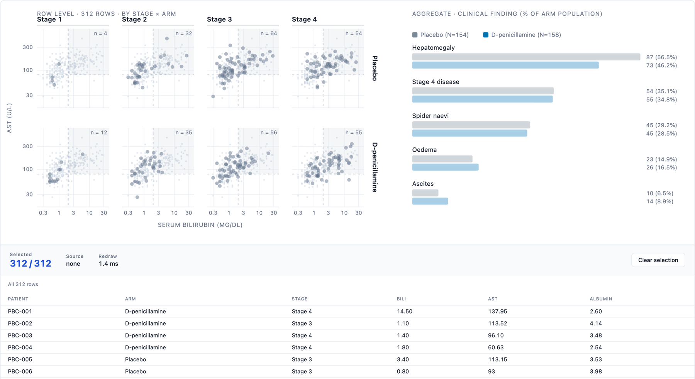
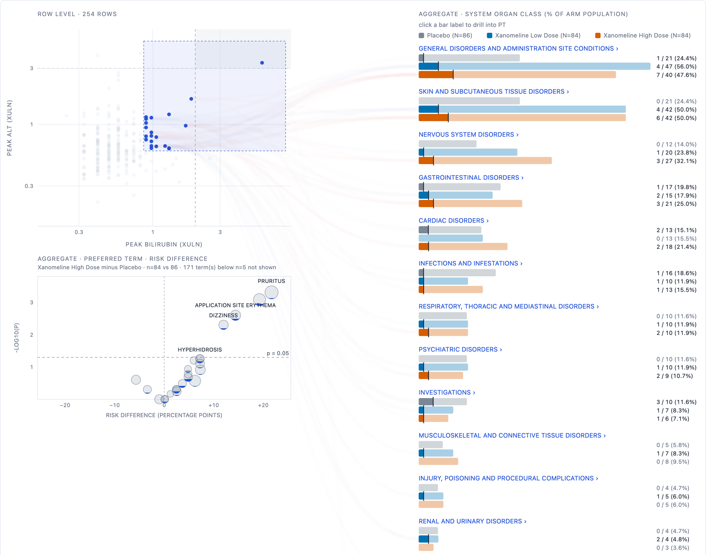
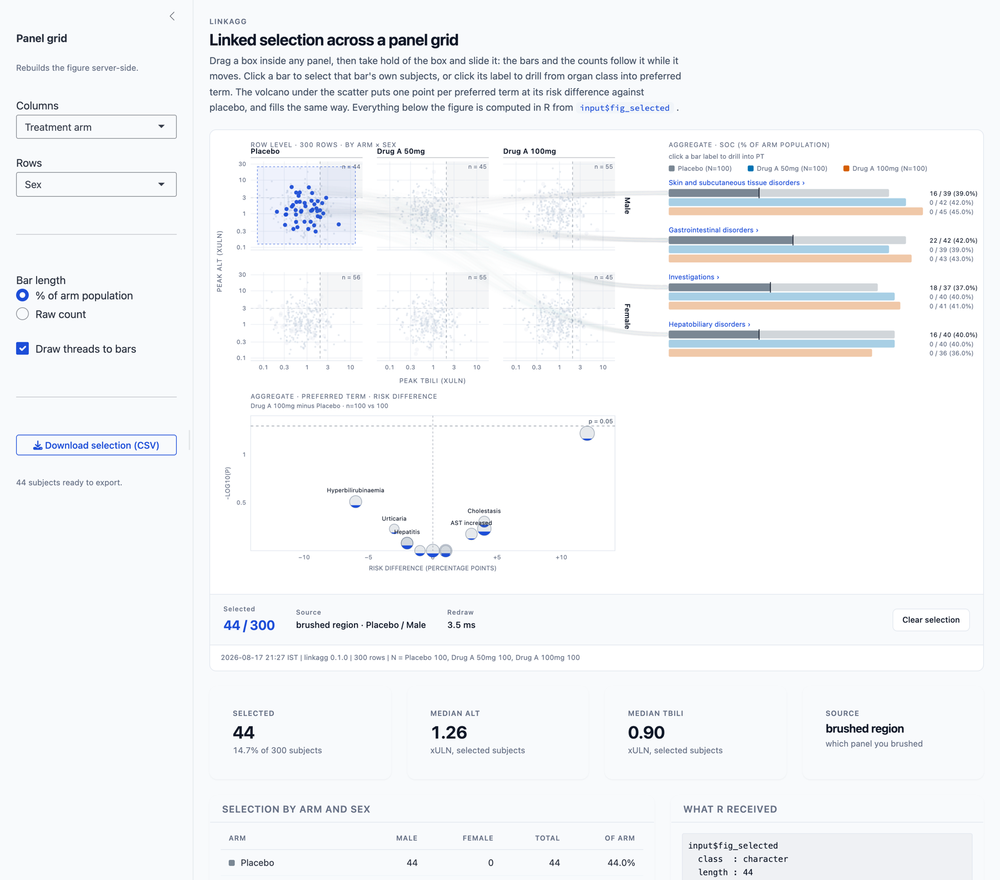

# linkagg

Brush a row-level display and watch aggregate displays fill in proportion to
the rows you selected.

Aggregate views such as bar charts summarise many rows into one mark. Existing
linked-brushing tools in R support only views of individual data points, and
crosstalk's authoring guide says partially highlighting a bar from a linked
selection is "not impossible" but unexplored, and advises steering clear.
`linkagg` keeps hold of the row-to-group mapping, so it can fill a bar
partially and draw the threads that produced the fill.

Output is an htmlwidget. It works inside Shiny, and it saves to a single
self-contained HTML file with no server, so an interactive figure can be
emailed, archived, and opened offline in five years like a static one.


*Real CDISC pilot data, recorded from the figure itself.*

*Hover a mark and it names the subject. Drag out a box and then take hold of
it: the box stays live, so you can slide it around the plot and the bars, the
counts and the listing underneath all follow it while it moves. That is what
makes it exploratory rather than a query, since you can sweep a region and
watch which organ classes respond instead of guessing, releasing, looking, and
guessing again. Click a bar rather than its label and the traffic
runs the other way, that bar's own subjects lighting up in the scatter and
becoming the listing. Click a bar's label instead and it walks down the MedDRA
hierarchy, organ class to preferred term to the term the investigator wrote,
with the breadcrumb walking back up.*

## Status

Early. Not on CRAN. Passes `R CMD check` clean (0 errors, 0 warnings, 0 notes)
on R 4.5.3, with 124 passing tests. Runs on real trial data (see *On a real
trial* below), but has not yet been used by anyone for a review question of
their own, and is not validated for regulated use.

The layout is fixed: row-level displays on the left, aggregate displays on the
right, listing below. Treat this as a working prototype, not a stable API.

## Install

```r
# install.packages("remotes")
remotes::install_github("renit12345-ship-it/linkagg")
```

## Try it

Three worked examples ship with the package. Each opens a figure in the
RStudio Viewer and leaves its data and the figure behind, under its own names,
so you can source all three in one session without them treading on each
other.

```r
library(linkagg)

source(system.file("examples/pbc-trial.R",  package = "linkagg"))  # real trial
source(system.file("examples/cdisc-adam.R", package = "linkagg"))  # real ADaM
source(system.file("examples/edish-demo.R", package = "linkagg"))  # simulated
```

| example | data | leaves behind |
|---------|------|---------------|
| `pbc-trial.R`  | Mayo Clinic PBC trial, 312 randomised patients, via `survival` | `pbc_pat`, `fig` |
| `cdisc-adam.R` | CDISC pilot ADSL / ADAE / ADLB, via `pharmaverseadam` | `cdisc_saf`, `fig` |
| `edish-demo.R` | simulated, 240 subjects, exercises every display | `demo_adsl`, `fig` |

## The demo app

The package ships a Shiny application that shows the linking working in both
directions. Run it with one call:

```r
linkagg::run_linkagg_app()
```


**Shiny drives the figure.** The sidebar chooses the grid variables, the bar
denominator and whether threads are drawn, and the figure is rebuilt server
side.

**The figure drives Shiny.** The brushed selection arrives back in R as
`input$fig_selected`, a character vector of key values, and everything below
the figure is computed from it: the summary cards, the arm by sex crosstab,
and a CSV export of exactly the subjects selected.

In the shot above, one cell of the grid is brushed, so the selection is the 44
male placebo subjects; the source line names the cell, each bar reports the
share of its own subjects caught, and the export is ready with those 44.

The application source is `inst/shiny/app.R`, which is worth reading if you
want to wire the widget into an app of your own.

## On a real trial

`pbc-trial.R` runs the figure on the Mayo Clinic primary biliary cholangitis
trial: real patient data from a real randomised study of D-penicillamine
against placebo, 1974 to 1984, 312 randomised patients, distributed in the
`survival` package and described in Fleming and Harrington (1991).

Two things come out of it that a static safety pack does not give you.

**The volcano finds nothing, correctly.** No clinical finding separates the
arms, the smallest p being 0.071, which is what randomisation of baseline
findings should look like. A display that manufactures a signal here would be
worse than useless.

**Brushing answers an overlap question.** Select the high-bilirubin,
high-AST corner and each finding fills to the share of its own patients you
just caught. For the region bilirubin >= 3 mg/dL and AST >= 100 U/L, 87 of 312
patients:

| finding      | patients | in the region | share | enrichment |
|--------------|----------|---------------|-------|------------|
| Ascites      | 24       | 14            | 58.3% | 2.09x      |
| Oedema       | 49       | 26            | 53.1% | 1.90x      |
| Spider naevi | 90       | 43            | 47.8% | 1.71x      |
| Stage 4      | 109      | 47            | 43.1% | 1.55x      |
| Hepatomegaly | 160      | 64            | 40.0% | 1.43x      |

Ordered by clinical severity: the decompensation signs concentrate in the
high-bilirubin patients, the least specific sign least. A frequency table
gives you "24 patients had ascites" and "87 had bilirubin >= 3" as separate
rows and cannot tell you that most of the ascites patients are the same
people. That overlap is the thing this package exists to show.

## Use

This sketch uses your own data. For something that runs as it stands, source
one of the examples above; each leaves its data frame and the figure behind
under its own names (`demo_adsl`, `cdisc_saf`, `pbc_pat`, and `fig`).

```r
library(linkagg)

# adsl is your own subject-level data, one row per subject, restricted to the
# safety population. adsl$SOC is a list-column: each element is that subject's
# system organ classes, so a subject with events in three SOCs contributes to
# three bars.

fig <- linkagg(adsl, USUBJID) |>
  view_points(TBILI, ALT,
              log_x = TRUE, log_y = TRUE,
              x_lab = "Peak total bilirubin (xULN)",
              y_lab = "Peak ALT (xULN)",
              zone  = list(x = 2, y = 3, label = "REFERENCE THRESHOLD")) |>
  view_bars(SOC, by = ARM, label = "System organ class") |>
  view_table(cols = c("USUBJID", "ARM", "ALT", "TBILI")) |>
  as_linkagg_widget(caption = "ADSL / ADAE, safety population, cut 2026-06-30")

htmlwidgets::saveWidget(fig, "figure.html", selfcontained = TRUE)
```

`selfcontained = TRUE` requires pandoc. RStudio bundles its own, so this works
from the RStudio console with no setup. From a plain terminal `Rscript` it will
fail with "requires pandoc" unless you point R at one first:

```r
Sys.setenv(RSTUDIO_PANDOC =
  "/Applications/RStudio.app/Contents/Resources/app/quarto/bin/tools/aarch64")
```

## Treatment arms and denominators

`by` splits every group into one sub-bar per arm, which is how safety displays
are actually read. Nobody reviews a pooled count of 58 subjects with a
gastrointestinal event; they review 22 on placebo against 36 on active.

With `by` set, bar length is the percentage of that arm's analysis population,
matching the denominator convention of a standard adverse event summary. The
denominator defaults to the number of rows per arm in `data`, which is correct
when `data` is the analysis population. When it isn't, say so explicitly:

```r
view_bars(SOC, by = ARM, population = c(Placebo = 80, "Drug A" = 82))
view_bars(SOC, by = ARM, population = adsl_full)   # counted, not taken as sizes
```

A missing or zero denominator is an error rather than a silent `NaN`, because a
percentage against the wrong denominator is the classic way these displays go
wrong and it is not something to discover in review.

Selecting rows fills each arm's sub-bar to the share of *that arm's* affected
subjects who are selected, so the comparison across arms stays honest.

## Faceting

`facet` draws one small multiple per level on shared scales, so panels are
comparable. Brushing acts within a single panel, which is the correct
semantics: selecting the high-ALT corner of the high-dose panel should not
sweep in placebo subjects.

```r
view_points(TBILI, ALT, log_x = TRUE, log_y = TRUE, facet = ARM)
```

Rows whose facet value is outside `facet_levels` are marked rather than
silently dropped, so a typo in a level name does not quietly remove subjects.

Add `facet_row` for a full grid: one column per level of `facet`, one row per
level of `facet_row`.

```r
view_points(TBILI, ALT, log_x = TRUE, log_y = TRUE,
            facet = ARM, facet_row = SEX)
```



*The PBC trial as a grid: disease stage across, treatment arm down. Every
panel also carries the whole cohort faintly behind its own patients, so a cell
can be read against the distribution as a whole and not only against itself.*

Scales stay shared across the whole grid, so every panel is comparable with
every other, and a brush still selects only the cell you dragged over: the
subjects in that arm *and* that sex. Internally a panel is one index,
`row * n_columns + column`, so the grid reuses the same selection path as a
single strip of panels rather than introducing a second one.

## Choosing columns at runtime

The view functions take a bare column name, a string, or any expression that
evaluates to a string. The last form is what makes them usable from Shiny,
where the column is chosen by the user:

```r
view_points(spec, TBILI, ALT, facet = input$fcol, facet_row = input$frow)
```

An expression evaluating to `NULL` means "no column", so an optional facet or
arm can be switched off without building a different call. A **bare name is
always taken literally**, so a variable that happens to share a column's name
can never silently redirect a reference. Wrap it in parentheses when you do
want the variable's value: `by = (arm_col)`.

## Drill-down

`drill` gives the levels below the grouping, coarse to fine. Click a bar label
to descend, click any step of the breadcrumb to come back to that level. Arm
splits, denominators and partial fills all work the same way at every depth.

```r
view_bars(SOC, by = ARM, drill = PT)            # one level
view_bars(SOC, by = ARM, drill = c(PT, LLT))    # the MedDRA hierarchy
```

The second form is the one a safety reviewer actually walks: organ class, to
preferred term, to the term the investigator wrote down. On the CDISC pilot
study, `Cardiac disorders > Myocardial infarction` holds 4 placebo, 2 low-dose
and 4 high-dose subjects, and drilling once more splits that preferred term
into what was really reported:

| lowest level term              | Placebo | Low | High |
|--------------------------------|---------|-----|------|
| Myocardial infarction          | 1       | 1   | 2    |
| Inferior myocardial infarction | 1       | 0   | 1    |
| Myocardial infarct             | 2       | 0   | 0    |
| Anteroseptal infarction        | 0       | 1   | 0    |
| Septal myocardial infarction   | 0       | 0   | 1    |
| **total**                      | **4**   | **2** | **4** |

Two of those rows are the same event spelled differently and three are
anatomically distinct infarctions. A preferred-term table shows one row of
ten; it cannot show you that.

Every drill column must pair positionally with the group: element `j` of
`PT[[i]]` is the term for element `j` of `SOC[[i]]`. Mismatched lengths are an
error naming the offending row and column, because a silent misalignment here
would attribute events to the wrong organ class.

## Histograms

The case crosstalk's own documentation names as unsupported, since each bar
stands for many rows. A selection fills each bin from the baseline up.

```r
view_hist(ALT, bins = 30, by = ARM, log = TRUE)
```

Log binning drops non-positive values, warns with the count, and reports the
number of unbinned rows on the display rather than passing over them.

## Volcano plot

```r
view_volcano(PT, by = ARM, ref = "Placebo", comp = "Drug A", min_n = 5)
```

One point per term, placed by risk difference (comparison minus reference, in
percentage points) against `-log10(p)` from Fisher's exact test. Volcano and
dot plots are the two displays content experts favour for summarising harms in
a trial, so this is the shape a safety reviewer already reads.

Each point stands for many subjects, which makes it an aggregate mark in the
sense this package exists for: with a selection active every point fills from
the bottom in proportion to the share of *its own* subjects selected. Brushing
the Hy's law corner of an eDISH plot and reading the volcano answers a question
no static safety pack contains: which adverse event signals those subjects
actually carry. In the bundled example, brushing 15 subjects from that corner
fills the four liver terms to 17 to 29% and every background term to under 6%.

The recognised weakness of a volcano is that it shows an effect estimate
without its precision: a term seen in two subjects can sit as far from the
origin as one seen in fifty. Two things guard against that here. Point area is
proportional to the number of subjects contributing, so sparse terms look
sparse; and `min_n` drops the thinnest terms while printing how many were
dropped on the display rather than passing over them silently. The `p = 0.05`
line is a guide to the eye with no multiplicity adjustment implied.

## Performance

Selection is a `Uint8Array` mask plus an `Int32Array` of selected indices, not a
`Set`. Point pixel positions are precomputed once, so brushing compares numbers
rather than running an inverse scale per point. Above `canvas_threshold` rows
(6,000 by default) the scatter renders to canvas.

The marks are drawn in two layers. Every mark goes on a base layer, painted
once per layout. Only the current selection goes on the layer above it, and a
selection dims the base with a CSS opacity change rather than repainting it.
The cost of a brush is therefore the size of the *selection*, not the size of
the dataset, which is what keeps a million rows responsive.

Measured end to end on one machine: building the spec in R, writing the file,
and the redraw the browser reports after a brush.

| subjects  | spec   | file size | brush redraw |
|-----------|--------|-----------|--------------|
| 254 (CDISC pilot) | 0.02 s | 0.4 MB | 3 ms |
| 10,000    | 0.03 s | 0.6 MB   | 5 ms   |
| 200,000   | 0.85 s | 12.3 MB  | 45 ms  |
| 1,000,000 | 4.5 s  | 61.3 MB  | 113 ms |

A million subjects redraw in about a tenth of a second, so drawing is no
longer what limits the size of a figure.

A brush resolves while it is still being dragged, and equally while an existing
box is being moved or resized, coalesced to one update per animation frame, and the cost of each of those updates is the size of the
selection rather than of the dataset. On a million subjects, sweeping out a
corner holding seventeen thousand of them updates in around 3 ms per frame.
Dragging until nearly the whole cohort is inside the box reaches about 180 ms,
which is the worst case and an odd thing to want. Only the threads wait for the release,
being the one part whose cost is not bounded by the listing's row cap.

What limits it now is the file. The row-level data travels inside the HTML, at
roughly 60 MB per million subjects, so a million-subject figure is a 61 MB
file. That is fine to open and awkward to email, and ten million would be
around 600 MB, which is not a figure you can archive or send at all. Cohorts
of that size want the aggregation done in R, with the widget receiving the
aggregate counts and a sample of the row layer rather than every row.

## Provenance

`as_linkagg_widget(stamp = TRUE)` is the default and writes a footer line
recording the render time, package version, row count and per-arm denominators.
Add `caption` for the dataset and any subset applied. Keep both on for anything
you intend to share or archive, since the whole argument for a single-file
interactive figure is that it can be treated like a controlled output.

## In Shiny

```r
ui <- fluidPage(linkaggOutput("fig", height = "760px"), verbatimTextOutput("n"))

server <- function(input, output) {
  output$fig <- renderLinkagg({
    linkagg(adsl, USUBJID) |>
      view_points(TBILI, ALT, log_x = TRUE, log_y = TRUE) |>
      view_bars(soc)
  })
  output$n <- renderPrint(length(input$fig_selected))
}
```

The current selection arrives as `input$<outputId>_selected`, a character
vector of key values, or `NULL` when nothing is selected.

The bundled demo app shows both directions at once:

```r
linkagg::run_linkagg_app()
```

Shiny drives the figure: sidebar controls pick the grid variables, the bar
denominator and whether threads are drawn, and the figure is rebuilt
server-side. The figure drives Shiny: the brushed selection feeds the summary
cards, an arm-by-sex crosstab and a CSV download, all computed in R from
`input$fig_selected`.

One gotcha: `linkaggOutput(height = )` does not resize the figure, it only
sizes the container. If the figure is taller than the container it overlaps
whatever follows. Match the two by ending the pipe with an explicit
`as_linkagg_widget(height = 800)` and setting the same value on the output.

## Threads

By default, selecting rows draws animated threads from each selected row to
every group it belongs to. This is the mapping the package exists to keep, made
visible. Turn it off with `linkagg(..., threads = FALSE)` for a quieter figure.
Threads are capped (`thread_cap`) and are suppressed when the browser reports
`prefers-reduced-motion`.

## Screenshots

The figure on real CDISC data, and the same trial as a panel grid:






## Scope

A figure holds one scatter, one bar display, one histogram and one volcano, in
fixed positions. Boxplots and time to onset displays are not implemented.
Above a million subjects the size of the self contained file, not the redraw,
is what sets the practical ceiling.

The package is a research tool. It is not qualified software and carries no
validation package, so it is suited to exploration and to the figures that
support a discussion, rather than to producing a regulatory deliverable.

## Licence

MIT. Bundles d3 v7.9.0 (ISC) in `inst/htmlwidgets/lib/`.
